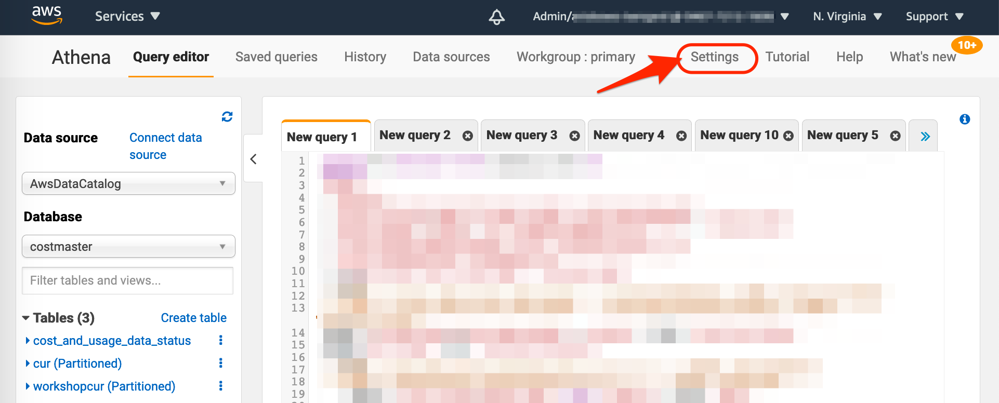
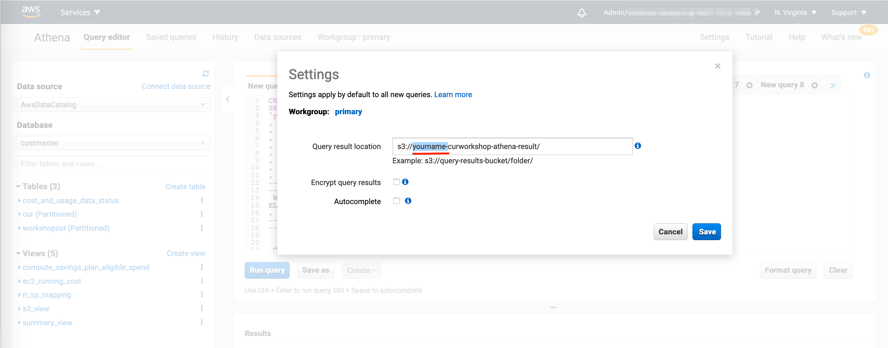

## LAB1 Notes

* Step 2 "USE AWS GLUE TO ENABLE ACCESS TO CUR FILES VIA AMAZON ATHENA", number 23: You need to spesify S3 bucket for Athena query result.
  
   In the Athena page, Click "Settings" on the top right page then specify S3 Bucket path (s3://yourname-curworkshop-athena-result/) 
   
   
   
   
  
* Step 3 "COST AND USAGE ANALYSIS, part "Savings Plans, Reserved Instance, On Demand and Spot Usage" number 1 & 2: There is no column name contains "savings" in the table, because the sample CUR files doesn't contain any Saving Plans data. You can ignore the error or skip the query execution.

  
