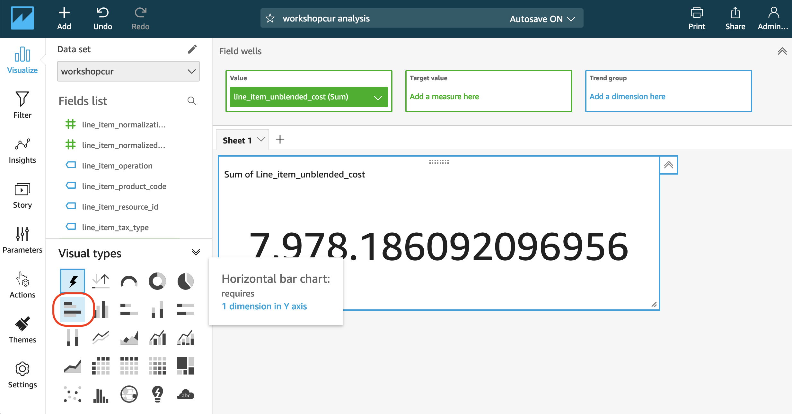
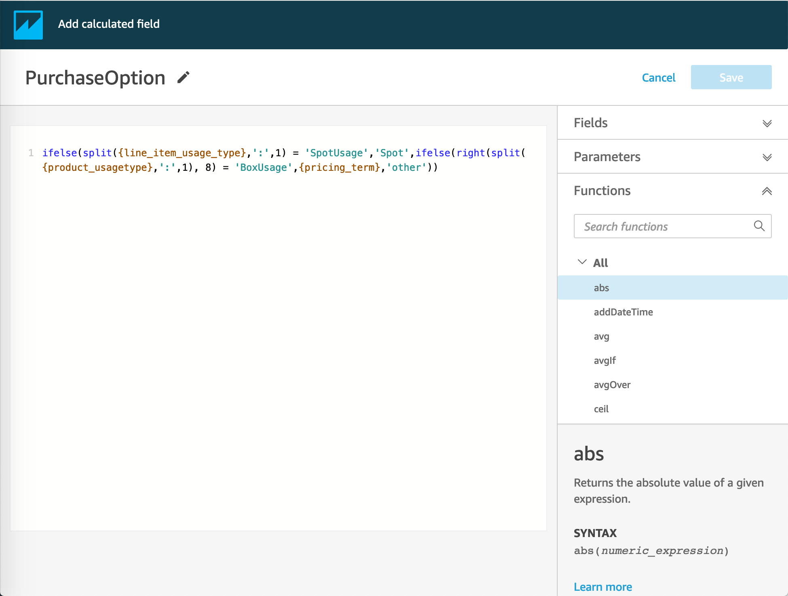

## LAB2 (CREATE VISUALIZATION) Notes

* Part **Cost by account and product**, number 1 to 2: Change the Visual Types to “Horizontal bar chart”
   
   
   
* Part **Cost by account and product**, number 9: Click exclude on the Legend (not the line)

* Part **Elasticity**, number 3: New versin of QuickSight UI (screenshoot) for "Add calculated field"
   
   
   
* Part **Elasticity**, number 22: click exclude on the legend (not the line)

* Part **Cost by line item description**, number 7 don't filter the date by today because the data is in year 2018 and month 10 until 12 (not 2020 month 9). Suggestion by time range between and input start and end date instead

   ![../images//quicksight_datefilter.png]

* Need to add user first so that you are able to share Analysis.
  - Click Admin icon on the top right-hand side, select Manage QuickSight
  - Click Invite User in the Manage user page. User should be AUTHOR/ADMIN in order to be able to see shared Analysis.

   
