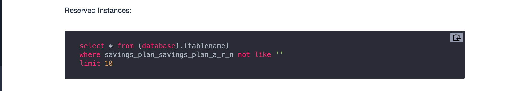

* This following query is not correct
  
  
  
  It should be changed to this:
  ```
  select * from costmaster.workshopcur
  where reservation_reservation_a_r_n  not like ''
  limit 10
  ```
  
* Since you are using sample CUR files in this workshop, there should be **no Savings Plans** but **it has Reserved Instances data**, so please select the correct query for creating Views accordingly.

   
   
* When you do **View 1 - Summary View** and get error when executing query. 
  Try to change empty string ('') to space (' ') or any character e.g. '-' in line 22:

  ```
  WHEN ("reservation_reservation_a_r_n" <> ' ') THEN "reservation_reservation_a_r_n" ELSE ' ' END "ri_sp_arn"
  ```
   
* On number 7 "Click here - if you do not see your dashboard", there is a typo on the second command:

  ```
  aws quicksight describe-dashboard --aws-account-id (YOUR ACCOUNT ID) --dashboard-id cost__intelligence_dashboard --region (region)
  ```
  It should be: `cost_intelligence_dashboard`  

  
* Dashbord will not show at first. There is error when creating dashboard due to datatype miss match in dataset `sumarry_view`

   Field `ri_sp_trueup` and `ri_sp_upfront_fees` should be **DECIMAL**

   ```
            "Errors": [
                {
                    "Type": "COLUMN_TYPE_MISMATCH",
                    "Message": "Required type for column 'ri_sp_trueup' in data set 'arn:aws:quicksight:us-east-1:0XXXXXXXXXXX:dataset/1afc97f3-a43c-4e76-89ab-ee3cc106da32' is 'NUMBER'"
                },
                {
                    "Type": "COLUMN_TYPE_MISMATCH",
                    "Message": "Required type for column 'ri_sp_upfront_fees' in data set 'arn:aws:quicksight:us-east-1:0XXXXXXXXXXX:dataset/1afc97f3-a43c-4e76-89ab-ee3cc106da32' is 'NUMBER'"
                }
            ],
   ```
   
     To change that, click `sumarry_view` in the QuickSight Dataset, click "Edit data set" button and then change data type for those two fields.
     
     
   


